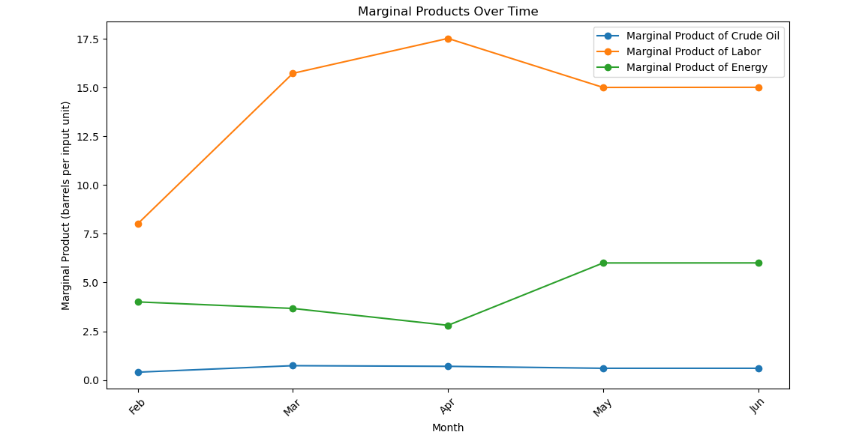
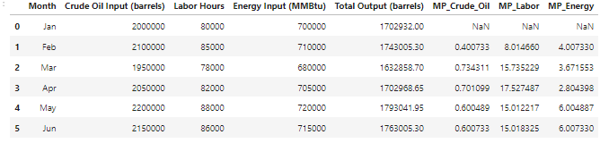
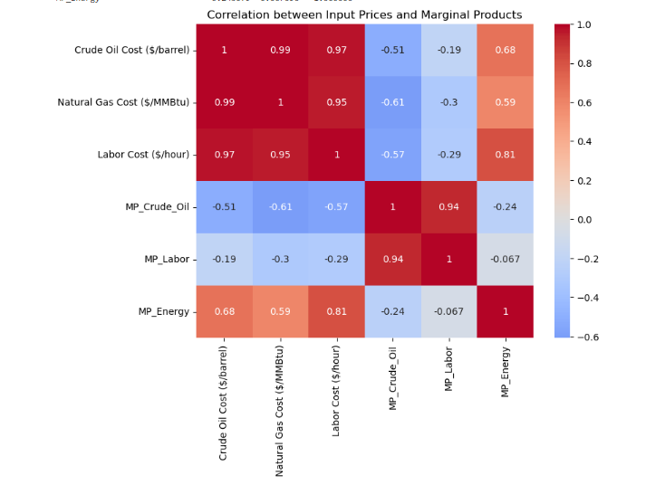
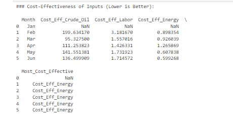

# Chevron-Refinery-Operations-Analysis-Simulation
This is a practical analysis using a simulation of a real world scenario hence the data set is hypothetical.


# Chevron Refinery Operations Analysis

## Table of Contents

- [Project Overview](#project-overview)
- [Data Sources](#data-sources)
- [Analysis Process](#analysis-process)
  - [Marginal Product Analysis](#marginal-product-analysis)
  - [Investigating Diminishing Returns](#investigating-diminishing-returns)
  - [Correlation Analysis](#correlation-analysis)
  - [Elasticity of Substitution](#elasticity-of-substitution)
  - [Cost Optimization Strategy](#cost-optimization-strategy)
- [Results and Recommendations](#results-and-recommendations)
- [Limitations](#limitations)
- [References](#references)

---

### Project Overview

This project aims to optimize Chevron’s refinery operations by analyzing key aspects of its production function, marginal products of inputs (crude oil, labor, and energy), elasticity of substitution between inputs, and cost-effectiveness. By analyzing the refinery’s production data, the goal is to provide actionable recommendations on how Chevron can enhance output, reduce costs, and maintain efficiency amid fluctuating input prices.

 <!-- Add the path to the image you want to upload -->

---

### Data Sources

- **Inputs**: Crude Oil (barrels), Labor (hours), Energy (MMBtu)
- **Outputs**: Gasoline, Diesel, Petrochemicals (barrels and tons)
- **Costs**: Crude Oil ($/barrel), Labor ($/hour), Natural Gas ($/MMBtu)
- **Marginal Products (MP)**: MP_Crude_Oil, MP_Labor, MP_Energy
- **Miscellaneous**: MRTS (Marginal Rate of Technical Substitution between crude oil and energy)

---

### Analysis Process

#### Marginal Product Analysis
The goal was to evaluate how additional inputs (crude oil, labor, energy) affect output and identify when diminishing returns set in.

Methodology:
Calculated marginal products for each input.
Assessed points where increasing inputs led to reduced incremental output (diminishing returns).
Focused on crude oil’s impact on gasoline output as it’s the most significant input.


#### Investigating Diminishing Returns
I used production data to identify the optimal level of crude oil input where returns start to diminish. Additionally, I analyzed the impact of energy efficiency—whether increasing energy usage improved output or if it became less effective over time.

Methodology:
Analyzed marginal product trends.
Plotted crude oil inputs against marginal output.
Investigated energy efficiency by comparing energy inputs to incremental outputs.


#### Correlation Analysis
This analysis examined the relationship between the input Prices and Marginal Products

Methodology:
Verified that all inputs (crude oil, labor, energy) Prices are related to Marginal Product.

####Elasticity of Substitution
The elasticity of substitution between crude oil and natural gas was calculated to determine how easily Chevron can switch between these energy sources without losing productivity.

Methodology:
Used MRTS data to quantify the substitution rate between crude oil and Energy.
Analyzed cost variations to suggest an optimal substitution strategy when input prices fluctuate.


#### Cost Optimization Strategy
Based on the analysis of marginal products and substitution elasticity, I developed a cost optimization strategy.

Methodology:
Combined price volatility data for crude oil, Energy and Labor.
Proposed an optimal input mix based on cost-effectiveness and productivity trends.

### Result and Recommendations

#### Marginal Product Analysis

The objective was to assess the impact of additional inputs on output and identify when diminishing returns occurred.

 <!-- Add the path to the image you want to upload -->

The marginal product of crude oil diminishes significantly after an input threshold (around 2.5 million barrels), meaning that increasing crude oil beyond this point leads to reduced additional output. Labor shows stable returns, while energy inputs yield the highest incremental output.

#### Investigating Diminishing Returns

 <!-- Add the path to the image you want to upload -->

You can observe the point where increasing inputs start yielding lower marginal products, 
which is indicative of diminishing returns. 
For example, in May, crude oil input increased significantly, but the marginal product of crude oil 
dropped to 0.600 barrels/barrel, implying that adding more crude oil isn't yielding proportionate output increases.

#### Correlation Analysis

 <!-- Add the path to the image you want to upload -->

1. Crude Oil Cost and Marginal Products:
   - Negative Correlation with MP_Crude_Oil: The correlation between crude oil cost and its marginal product (MP_Crude_Oil) is -0.51. This indicates that as crude oil prices increase, the refinery's efficiency in producing output from additional barrels of crude oil decreases. Essentially, higher crude oil prices lead to diminishing returns in crude oil input efficiency.
   - Positive Correlation with MP_Energy: There is a positive correlation (0.68) between crude oil cost and MP_Energy, meaning that when crude oil prices rise, energy inputs are used more efficiently. This could indicate a shift in focus to optimize energy use when crude oil becomes more expensive.

2. Natural Gas Cost and Marginal Products:
   - Negative Correlation with MP_Crude_Oil: The correlation between natural gas cost (energy) and MP_Crude_Oil is -0.61, showing that as natural gas prices increase, the efficiency of crude oil inputs declines. This suggests an indirect effect where higher energy costs make it less efficient to utilize crude oil for production.
   - Moderate Positive Correlation with MP_Energy: A moderate positive correlation (0.59) between natural gas cost and MP_Energy suggests that when energy costs increase, the marginal product of energy also increases. This could imply that higher energy prices lead to a more judicious or optimized use of energy inputs.

3. Labor Cost and Marginal Products:
   - Weak Negative Correlation with MP_Labor: The correlation between labor cost and MP_Labor is -0.29, indicating that as labor costs increase, the marginal product of labor decreases slightly. This means that labor becomes less efficient when its cost rises, although the relationship is not particularly strong.
   - Strong Positive Correlation with MP_Energy: There is a strong positive correlation (0.81) between labor cost and MP_Energy, suggesting that as labor costs increase, the refinery compensates by using energy more efficiently. This may indicate a shift towards energy-intensive processes as labor becomes more expensive.

---
 
Main Insights:

1. Diminishing Returns from Crude Oil:
   - As crude oil prices increase, the marginal product of crude oil decreases, reflecting diminishing returns from this input. The refinery becomes less efficient at converting additional barrels of crude oil into output when prices are high.

2. Energy Efficiency Increases with Rising Input Prices:
   - Both crude oil and natural gas prices are positively correlated with the marginal product of energy. This indicates that when input prices rise (particularly crude oil), the refinery shifts focus to improve energy efficiency, possibly due to cost-saving measures or process adjustments.

3. Labor and Energy Substitution:
   - The strong positive correlation between labor cost and MP_Energy suggests that the refinery relies more heavily on energy efficiency when labor costs rise. This could indicate a **substitution effect where higher labor costs lead to increased reliance on energy to maintain output levels.

---

Actionable Insights for Chevron:

1. Monitor Crude Oil Prices:
   - As crude oil prices increase, the refinery should anticipate diminishing returns on crude oil input and seek strategies to optimize crude oil use or shift reliance to other inputs.

2. Energy Optimization:
   - Higher energy prices seem to drive better energy efficiency, suggesting that ongoing improvements in energy management could offset rising crude oil and labor costs.

3. Labor and Process Efficiency:
   - Rising labor costs reduce the efficiency of labor inputs. Automation or energy-intensive processes may become more attractive as labor becomes more expensive.

---

#### Elasticity of Substitution

 <!-- Add the path to the image you want to upload -->

Main Insights:

1. Substitutability Challenges: In June, the elasticity of substitution is nearly zero, making substitution almost impossible.
2. Optimal Substitution in Apr: In April, crude oil and energy were more easily substituted, shown by positive elasticity.
3. Energy Efficiency in May: In May, energy efficiency was improved, but crude oil and energy were harder to substitute.
4. High Volatility in June: The drastic value in June indicates challenges with substitutability, warranting further investigation.

Recommendations:

1. Focus on Operational Adjustments in June: Investigate why substitutability was difficult in Jun and address inefficiencies.
2. Improve Energy Management: Negative elasticity in May and Jun suggests a need to optimize energy management.

---

#### Cost Optimization Strategy

 <!-- Add the path to the image you want to upload -->

1. Most Cost-Effective Input:
   - Across the months from February to June, energy consistently appears as the most cost-effective input.
     This means that, relative to its cost, energy inputs yield the highest returns in terms of output compared to labor and crude oil.
   - In January, data is missing, so no conclusions can be drawn for that month.

2. Crude Oil Cost-Effectiveness:
   - The cost per marginal product of crude oil fluctuates across the months, ranging from 95.33 in March to 199.63 in February.
   - Crude oil is much less cost-effective than energy, with significantly higher costs per unit of output.
   - In some months, the cost-effectiveness of crude oil improves (like in March), but it remains consistently more expensive than energy.

3. Energy Cost-Effectiveness:
   - Energy consistently has the lowest cost per marginal product, with values ranging from 0.599 in June to 0.926 in March.
   - This suggests that energy input provides a much better return on investment compared to crude oil and labor, making it a more efficient resource in production.
   - Optimizing energy usage can yield substantial cost savings for Chevron.

4. Labor Cost-Effectiveness:
   - Labor has a relatively stable cost-effectiveness across the months, with values ranging from 1.426 in April to 3.182 in February.
   - While more cost-effective than crude oil, labor is less efficient than energy.
   - This suggests that labor is moderately cost-effective, but its performance is not as consistently efficient as energy.

Insights:
- Energy input is consistently the most cost-effective, suggesting a clear focus on optimizing energy use in the refinery could maximize output at the lowest cost.
- Crude oil is the least cost-effective input, with a much higher cost per marginal product, indicating diminishing returns as crude oil costs rise.
- Labor shows moderate cost-effectiveness, but its cost-effectiveness does not vary dramatically, implying stable but not exceptional returns relative to its cost.

---

#### Limitaions

Data Granularity: The dataset lacks sufficient granularity for a detailed elasticity of substitution analysis between different energy sources.

---

```python
# Example code snippet
def marginal_product(input, output):
    return (output[1:] - output[:-1]) / (input[1:] - input[:-1])
